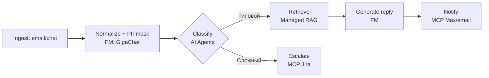

# AI Factory Mapper: декомпозиция сценариев на Cloud.ru Evolution AI Factory

## Что делает этот скилл

Берёт произвольный бизнес-сценарий (агент поддержки, обработка документов, маркетинг, devops, discovery — что угодно) и превращает его в **оптимальный пайплайн реализации на Cloud.ru Evolution AI Factory** с честной оценкой покрытия и явным списком того, что придётся делать кастомом.

**Ключевая философия — оркестрация, а не копирование.** Этот скилл не дублирует логику других скиллов: он **вызывает** их через `view()` и использует результаты.

## Какие скиллы оркестрирует (и когда)

| Когда нужен | Какой скилл вызвать | Как |
|---|---|---|
| Задача сформулирована расплывчато | `explore` | `view .claude/skills/explore/SKILL.md` |
| Нужна first-principles декомпозиция на шаги | `problem-solver-enhanced` | `view .claude/skills/problem-solver-enhanced/SKILL.md` |
| Нужна верификация новинок каталога / источников | `goap-research-ed25519` | `view .claude/skills/goap-research-ed25519/SKILL.md` |
| Комплексный анализ с checkpoints | `analyst-manual-full` | `view .claude/skills/analyst-manual-full/SKILL.md` |
| Финальный DOCX-отчёт | `docx` (public, host-provided) | `view /mnt/skills/public/docx/SKILL.md` |

**Правило:** сначала прочитай SKILL.md нужного скилла, потом следуй его инструкциям. Не переписывай его логику в этот SKILL.md.

## Bundled resources

```
ai-factory-mapper/
├── SKILL.md                               # этот файл (workflow + оркестрация)
├── references/
│   ├── catalog.md                         # актуальный каталог AI Factory (обновлять!)
│   ├── decomposition-checklist.md         # 10-пунктов чек-лист декомпозиции workflow
│   ├── coverage-formula.md                # формула оценки покрытия в %
│   └── pattern-library.md                 # типовые паттерны (ingest/RAG/routing/...)
├── assets/
│   └── report-template.md                 # шаблон финального отчёта
└── scripts/
    └── build_docx_report.js               # генератор DOCX из структурированного JSON
```

**Когда читать reference-файлы:**
- `catalog.md` — **ВСЕГДА перед маппингом** (Phase 3). Это единственный источник правды о составе AI Factory.
- `decomposition-checklist.md` — на фазе декомпозиции, чтобы не забыть неочевидные этапы (PII, compliance, close-loop).
- `coverage-formula.md` — при расчёте итогового %. Нужно для воспроизводимости оценок между запусками.
- `pattern-library.md` — когда встречается типовой паттерн (RAG-поддержка, ingest-extract-validate, и т.д.) — даёт готовые решения.
- `report-template.md` — финальная синтеза.

## Workflow архитектура

```
┌──────────────────────────────────────────────────────────────────────┐
│  INPUT: один или несколько сценариев от пользователя                  │
│                            ↓                                          │
│  GATE: Ясна ли задача?                                                │
│  → Нет? → Phase 0: Explore (через view explore skill)                 │
│  → Да?  → сразу Phase 1                                               │
│                            ↓                                          │
│  Phase 1: CATALOG SYNC                                                │
│  → Прочитать references/catalog.md                                    │
│  → web_search новинок (обязательно, каталог быстро меняется)          │
│  → При необходимости — goap-research-ed25519 для верификации          │
│                            ↓                                          │
│  Phase 2: DECOMPOSITION (на каждый сценарий)                          │
│  → First principles — через view problem-solver-enhanced              │
│  → Применить decomposition-checklist.md                               │
│  → Результат: линейный список 7–12 шагов workflow                     │
│                            ↓                                          │
│  Phase 3: MAPPING                                                     │
│  → На каждый шаг: подобрать сервис/сервисы из catalog.md              │
│  → Присвоить степень покрытия: ✅ Полное / ⚠️ Частичное / ❌ Нет      │
│  → Если совпал типовой паттерн — взять из pattern-library.md          │
│                            ↓                                          │
│  Phase 4: GAP IDENTIFICATION                                          │
│  → Выписать все шаги с ❌ и ⚠️                                       │
│  → Для каждого gap: что мешает и чем закрыть                          │
│                            ↓                                          │
│  Phase 5: COVERAGE SCORING                                            │
│  → Применить формулу из coverage-formula.md                           │
│  → Получить % покрытия для каждого сценария                           │
│                            ↓                                          │
│  Phase 6: SYNTHESIS & OUTPUT                                          │
│  → Если сценариев >1 — таблица ранжирования                           │
│  → Mermaid-диаграмма пайплайна (в Markdown и через MCP Mermaid если   │
│    доступен)                                                          │
│  → DOCX-отчёт через scripts/build_docx_report.js                      │
│  → present_files                                                      │
└──────────────────────────────────────────────────────────────────────┘
```

## Phase execution protocol

### Gate: оценка ясности задачи

Перед началом проверь:
1. Есть ли у пользователя конкретный сценарий с описанием цели, пользователя, входа, выхода?
2. Или это общий запрос «как сделать X на AI Factory»?

Если второе — **прочитай `.claude/skills/explore/SKILL.md` и следуй его инструкциям** для уточнения. Не пытайся угадать.

Если задача ясна (например, даётся список сценариев с описанием, как в примере ниже) — переходи к Phase 1.

**Пример ясной задачи:**
> «Есть 5 сценариев, разложи каждый на пайплайн AI Factory с оценкой покрытия»

**Пример неясной:**
> «Можем ли мы использовать AI Factory?»  → нужен Explore

### Phase 1: Catalog sync

**Шаги:**
1. **ВСЕГДА** прочитай `references/catalog.md` — это базовый справочник, но он может устареть.
2. **ВСЕГДА** сделай `web_search` с запросом `Cloud.ru Evolution AI Factory новые сервисы <текущий_год>` и `Cloud.ru новые MCP серверы <текущий_год>`, чтобы проверить свежие анонсы. Каталог обновляется быстро — пропуск этого шага приводит к ложным gap'ам.
3. Если пользователь явно указал «используй только актуальные данные» или работа критическая (enterprise-продукт, внешний клиент) — вызови `goap-research-ed25519`:
   - Прочитай `.claude/skills/goap-research-ed25519/SKILL.md`
   - Цель: `goal_type="verified_exploratory"`, тема — «Cloud.ru Evolution AI Factory current services catalog»
4. Зафиксируй в working memory перечень сервисов на момент анализа (это важно для воспроизводимости оценок).

**Если найдены НОВЫЕ сервисы, не учтённые в catalog.md:**
- Добавь их в working memory для текущего анализа
- В итоговом отчёте укажи секцию «Свежие анонсы» со ссылкой на источник
- В конце предложи пользователю: «Хотите ли обновить references/catalog.md в скилле?»

### Phase 2: Decomposition (first principles)

**Для каждого сценария:**

1. Прочитай `.claude/skills/problem-solver-enhanced/SKILL.md` — это базовая методология декомпозиции. **Применяй модули 1 (First Principles) и 6 (Contradiction Analysis) как минимум.**

2. Открой `references/decomposition-checklist.md` и пройди по каждому из 10 пунктов:
   - Ingest — откуда/в каком формате приходит вход
   - Normalize — нужно ли нормализовать/маскировать/распознавать
   - Classify/Route — нужна ли классификация
   - Retrieve — нужен ли поиск контекста в корпоративных данных
   - Reason/Generate — LLM-reasoning или генерация
   - Validate — проверки корректности, бизнес-правила, compliance
   - Act — действие во внешней системе
   - Notify — коммуникация с пользователем/операторами
   - Log/Audit — что и куда пишем
   - Feedback/Learn — как улучшается система

3. Результат для каждого сценария — **линейный нумерованный список из 7–12 шагов**. Не больше — иначе детализация слишком глубокая; не меньше — иначе маппинг получится слишком крупнозернистым.

**Антипаттерн:** не начинай с сервисов AI Factory и не натягивай сценарий на них. Иди от логики задачи к технологии, а не наоборот.

### Phase 3: Mapping

Для каждого шага из Phase 2:

1. Открой `references/pattern-library.md` — проверь, совпадает ли шаг с типовым паттерном. Если да — бери готовое решение.
2. Иначе — подбери сервис(ы) из `references/catalog.md` по трём слоям в порядке предпочтения:
   - **Слой 1**: готовый AI-агент (минимум кастома)
   - **Слой 2**: MCP-сервер + AI Agents/AI Workflows (low-code оркестрация)
   - **Слой 3**: Foundation Models / ML Inference / Managed RAG + кастом-промпты
3. Присвой **степень покрытия** по простому правилу:
   - ✅ **Полное** — шаг закрывается готовым сервисом/сервисами без написания коннекторов, fine-tuning или развёртывания кастомных моделей.
   - ⚠️ **Частичное** — платформа закрывает 50–80% шага, но требуется настройка (кастомный промпт, небольшой custom-node, развертывание готовой open-source модели в ML Inference без fine-tuning).
   - ❌ **Нет** — требуется писать собственный MCP, интегрироваться с внешней системой, для которой нет коннектора, дообучать модель, или вообще выходить за пределы LLM-стека.

**Правило однозначности:** если колеблешься между ✅ и ⚠️ — выбирай ⚠️. Если между ⚠️ и ❌ — выбирай ❌. Честная оценка ценнее оптимистичной.

### Phase 4: Gap identification

Из всех шагов с ⚠️ и ❌:

Для каждого gap'а сформулируй:
- **Что не хватает** (одно предложение)
- **Почему это gap** (что именно в платформе не закрывает задачу)
- **Варианты закрытия**:
  - (a) Деплой open-source модели в Evolution ML Inference
  - (b) Написание кастомного MCP
  - (c) Интеграция через HTTP-узел в AI Workflows
  - (d) Внешний API / сторонний сервис
  - (e) Out-of-scope для AI Factory (нужен отдельный инструмент)

Типовые gap'ы, которые встречаются часто (используй как подсказку):
- **OCR сканов** — нет в каталоге; закрывается деплоем PaddleOCR/docTR через ML Inference
- **STT / распознавание речи** — нет; деплой GigaAM/Whisper через ML Inference или Yandex SpeechKit как внешний API
- **Image/Video generation** — нет как сервис; деплой Flux/SDXL через ML Inference
- **MCP к 1С / SAP / SharePoint** — нет; кастом через OData/RFC
- **MCP к ЭДО (Диадок/СБИС)** — нет; кастомный коннектор
- **MCP к Git-платформам (GitLab/GitVerse)** — нет; кастом
- **MCP к рекламным кабинетам (VK/Yandex Direct)** — нет
- **ЭЦП валидация** — out-of-scope, нужна КриптоПро/VipNet

### Phase 5: Coverage scoring

Прочитай `references/coverage-formula.md` и примени формулу.

Базовая логика (детали в файле):
```
coverage = (N_full × 1.0 + N_partial × 0.5 + N_none × 0.0) / N_total
```

Где `N_full`, `N_partial`, `N_none` — количество шагов с ✅, ⚠️, ❌ соответственно, `N_total` — общее число шагов workflow.

Результат округляется до 5% (никаких «73.4%», только «~75%»). Это честнее: точность оценки не больше 5% в силу субъективности присвоения категорий.

### Phase 6: Synthesis & output

**Структура итогового отчёта** — см. `assets/report-template.md`. Краткий состав:

1. **Executive Summary** — паттерн, ключевой вывод, приоритетные gap'ы
2. **Справочник AI Factory** — сервисы на момент анализа
3. **По каждому сценарию**: декомпозиция → маппинг-таблица → gap'ы → покрытие
4. **Mermaid-диаграмма пайплайна** (для самого сложного сценария или по одной на каждый)
5. **Сводная таблица ранжирования** (если сценариев >1)
6. **Выводы и рекомендации**

**Mermaid-диаграмма пайплайна** — в двух формах:
- Inline Markdown (через ```mermaid блок) — всегда
- Если доступен `MCP Mermaid Server` из каталога Cloud.ru — упомяни в выводе как вариант для production-рендера

**Пример Mermaid для типового сценария:**


**Генерация DOCX:**
1. Собери данные анализа в структурированный JSON (см. `scripts/build_docx_report.js` — там описан формат).
2. Запусти `node scripts/build_docx_report.js <input.json> <output.docx>`.
3. Валидируй через `python /mnt/skills/public/docx/scripts/office/validate.py <output.docx>`.
4. Скопируй в `/mnt/user-data/outputs/` и вызови `present_files`.

**Если пользователь явно попросил только Markdown** — пропусти DOCX и выдай только `.md`.

## Output inventory

| Артефакт | Файл | Обязательно? |
|---|---|---|
| Markdown отчёт | `ai_factory_analysis.md` | ✅ |
| DOCX отчёт | `ai_factory_analysis.docx` | ✅ (если пользователь не попросил иначе) |
| Mermaid диаграммы | встроены в md/docx | ✅ |
| JSON с raw-данными анализа | `analysis.json` | Опционально (для программного использования) |

## Quality checklist

Перед выдачей результата пройдись:

- [ ] Catalog sync выполнен (web_search + catalog.md прочитан)
- [ ] Каждый сценарий декомпозирован на 7–12 шагов (не больше/меньше)
- [ ] Каждый шаг имеет явное присвоение ✅/⚠️/❌ (без «скорее всего»)
- [ ] Gap'ы имеют предложенные варианты закрытия
- [ ] % покрытия округлены до 5%
- [ ] Если сценариев >1 — есть ранжирование
- [ ] Есть минимум одна Mermaid-диаграмма
- [ ] DOCX прошёл валидацию (или пользователь попросил только md)
- [ ] Ничего не додумано: если сервиса нет в каталоге — он честно отмечен как gap, а не «предположительно есть»

## Antipatterns — чего НЕ делать

1. **Не пропускай catalog sync.** Каталог обновляется ежемесячно. Без актуализации ты будешь говорить «нет OCR-сервиса», когда его уже добавили.

2. **Не натягивай сценарий на сервисы.** Сначала workflow — потом mapping. Иначе получается product-marketing, а не инженерный анализ.

3. **Не пиши «предположительно покрывается через…»** — это бесполезная оценка. Либо ты знаешь, что сервис это делает (потому что он в каталоге и у него есть такая функция), либо это gap.

4. **Не завышай оценку покрытия.** Пользователь заплатит за это в продакшне. Если сомневаешься — ставь ⚠️ или ❌.

5. **Не копируй логику других скиллов.** Если нужна декомпозиция — вызови `problem-solver-enhanced`. Если research — `goap-research-ed25519`. Если DOCX — `docx`. Этот скилл — дирижёр.

6. **Не забывай про нетекстовые модальности.** OCR, STT, image-gen, видео — типичные белые пятна. Не маскируй их под «можно через FM».

7. **Не выдумывай MCP-серверы.** Если конкретного MCP нет в каталоге — так и скажи. «Нужно написать кастомный MCP для X» — валидный ответ.

## Примеры триггерных фраз (для понимания «когда использовать»)

- «Разложи задачу X на сервисы AI Factory»
- «Какие сервисы Cloud.ru нужны, чтобы сделать агента поддержки?»
- «Можно ли реализовать обработку счетов на Evolution AI Factory?»
- «Собери пайплайн маркетингового агента на AI Factory»
- «Какое покрытие у сценария X сервисами Cloud.ru?»
- «Что из этого можно сделать на AI Factory, а что нет?»
- «Сравни 3 сценария по тому, насколько они покрыты AI Factory»
- «Сделай TCO-оценку реализации X на Cloud.ru» (частично — этот скилл даёт основу, TCO считается отдельно)

## Dependencies

- **Node.js + docx package** — для `build_docx_report.js` (обычно уже установлен через `npm install -g docx`)
- **Python 3 + pandoc** — для валидации DOCX через скрипт из публичного docx-скилла
- Внешние скиллы: `explore`, `problem-solver-enhanced`, `goap-research-ed25519`, `docx`

## Maintenance notes

Раз в 1–2 месяца обновляй `references/catalog.md`:
- Проверь `cloud.ru/products/evolution-ai-factory` на новые сервисы
- Пройдись по каталогу агентов и MCP на Evolution Agents Marketplace
- Обнови дату в шапке файла

Если появились фундаментально новые категории (например, Evolution Video Generation, Evolution Voice Synthesis) — добавь их в `pattern-library.md` как новые паттерны.
