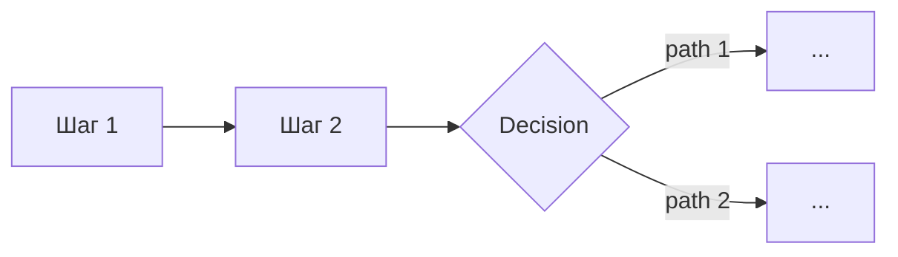

# [Название задачи] — анализ покрытия AI Factory

**Дата анализа:** [дата]
**Версия каталога:** [дата последнего обновления catalog.md] + web_search от [дата]
**Методология:** First Principles (через problem-solver-enhanced) + AI Factory Coverage Framework

---

## Executive Summary

**TL;DR:** [одно-два предложения о главном]

**Ключевые выводы:**
- [Паттерн, который обнаружен]
- [Главная сильная сторона покрытия]
- [Главные пробелы]

**Если сценариев несколько — сводная таблица:**

| Ранг | Сценарий | Покрытие | Главные gaps |
|---|---|---|---|
| 1 | [название] | ~XX% | [1–2 gap'а] |
| 2 | [название] | ~XX% | [1–2 gap'а] |

---

## Справочник AI Factory (на момент анализа)

**Платформенные сервисы:** [перечислить]
**Готовые агенты:** [сколько и какие релевантные]
**MCP-серверы:** [сколько и какие релевантные]

**Новинки с момента последнего обновления catalog.md** (если найдены через web_search):
- [если есть]

---

## Сценарий [N]: [Название]

### Декомпозиция workflow

Пройдено по decomposition-checklist.md. Результат — [количество] шагов:

1. **[Название шага]** — [краткое описание]
2. **[Название шага]** — [краткое описание]
...

### Маппинг на сервисы AI Factory

| # | Шаг | Сервис AI Factory | Покрытие |
|---|---|---|---|
| 1 | ... | ... | ✅ Полное |
| 2 | ... | ... | ⚠️ Частичное |

### Mermaid-диаграмма пайплайна

### Что нельзя сделать «из коробки»

**Gap 1: [название]**
- **Что не хватает:** [одно предложение]
- **Почему:** [причина]
- **Варианты закрытия:** [(a) деплой через ML Inference / (b) кастомный MCP / (c) внешний API / (d) out-of-scope]

**Gap 2: ...**

### Расчёт покрытия

| Категория | Count | Вес | Вклад |
|---|---|---|---|
| ✅ Полное | N_full | 1.0 | X |
| ⚠️ Частичное | N_partial | 0.5 | Y |
| ❌ Нет | N_none | 0.0 | 0 |
| **Итого** | **N_total** | — | **X+Y** |

- coverage_raw = (X + Y) / N_total = Z
- coverage_pct = round(Z × 100 / 5) × 5 = **WW%**
- Применены модификаторы: [перечислить, если были]
- **Итоговое покрытие: XX%**

---

## [Повтор блока «Сценарий N» для каждого сценария]

---

## Сводное ранжирование (если сценариев >1)

| Ранг | Сценарий | Покрытие | Ключевые готовые сервисы | Главные gaps |
|---|---|---|---|---|
| 🥇 1 | [...] | ~XX% | [...] | [...] |
| 🥈 2 | [...] | ~XX% | [...] | [...] |

---

## Выводы и рекомендации

### Общий паттерн
[Что именно AI Factory покрывает хорошо, а что плохо в этом наборе сценариев]

### Приоритетные gaps для развития платформы
[1–5 дополнений к каталогу, которые бы закрыли больше всего пробелов]

### Рекомендации по реализации
1. **Что делать сразу** (high-coverage сценарии)
2. **Что делать с кастомом** (middle-coverage сценарии — гибридная архитектура)
3. **Что пересмотреть** (low-coverage сценарии — возможно, другая платформа / разбиение)

### Паттерн гибридной реализации

Для сценариев с покрытием 60–75% — типовой подход:
- **Ядро оркестрации:** AI Workflows + AI Agents
- **LLM-слой:** Foundation Models + Managed RAG
- **Кастомные интеграции:** собственные MCP в Managed Kubernetes + HTTP-узлы в AI Workflows
- **Нестандартные модели:** деплой через Evolution ML Inference
- **Детерминированная логика:** Notebooks или отдельные сервисы на PostgreSQL
