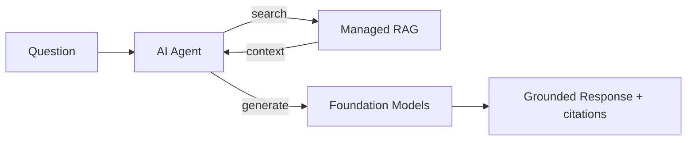
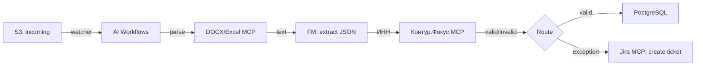
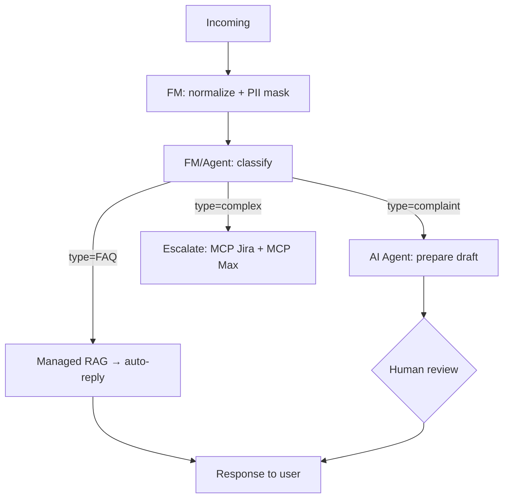
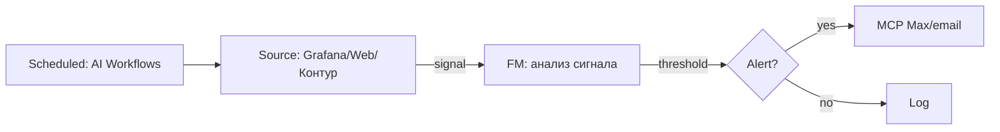
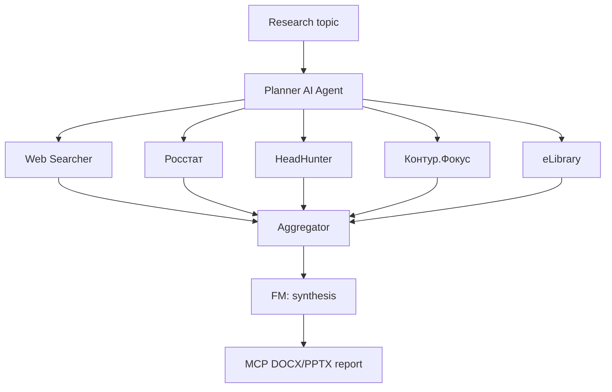
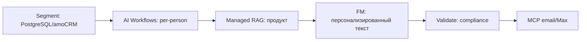
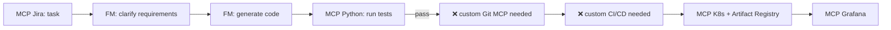
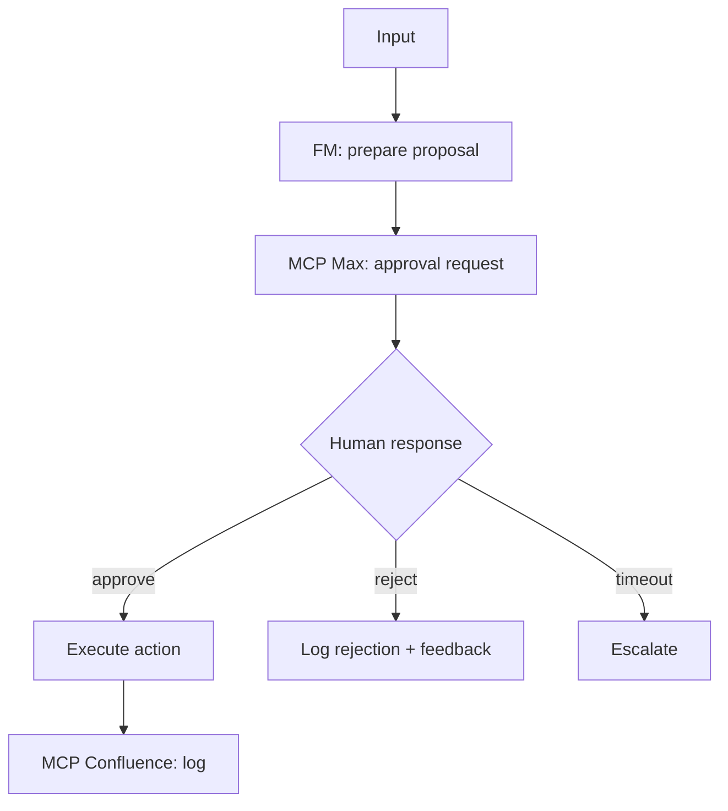

# Pattern Library — типовые паттерны AI Factory

> **Цель:** ускорить маппинг. Если шаг workflow совпадает с одним из известных паттернов — бери готовое решение вместо того, чтобы думать с нуля.

---

## Индекс паттернов

| # | Паттерн | Встречается в |
|---|---|---|
| 1 | [RAG-ответ на базе корпоративной БЗ](#pattern-1-rag-ответ) | Поддержка, FAQ, HR-чат-боты, Discovery |
| 2 | [Ingest → Extract → Validate → Route](#pattern-2-document-processing) | Счета, договоры, заявки |
| 3 | [Classify → Route → Escalate](#pattern-3-classify-route-escalate) | Helpdesk, модерация, triage |
| 4 | [Scheduled monitoring + alerting](#pattern-4-monitoring-alerting) | SRE, бизнес-мониторинг, мониторинг рынка |
| 5 | [Multi-source research + synthesis](#pattern-5-multi-source-research) | Discovery, due diligence, comp intel |
| 6 | [Content generation + personalization](#pattern-6-content-generation) | Маркетинг, рассылки, сейлзы |
| 7 | [Code generation + review](#pattern-7-code-generation) | DevOps, автоматизация разработки |
| 8 | [Human-in-the-loop approval](#pattern-8-human-in-the-loop) | Финансы, compliance, модерация |
| 9 | [Omnichannel aggregation](#pattern-9-omnichannel) | Любые коммуникационные сценарии |
| 10 | [Decision support с объяснением](#pattern-10-decision-support) | Скоринг, рекомендации, риск-аналитика |

---

## Pattern 1: RAG-ответ

**Задача:** пользователь задаёт вопрос → система ищет ответ в корпоративной базе знаний → возвращает grounded-ответ с цитатами.

**Компоненты AI Factory:**
- Evolution Managed RAG — основа
- Foundation Models — генерация ответа
- Evolution AI Agents или AI Workflows — оркестрация
- MCP Managed RAG — если RAG вызывается как tool

**Архитектура:**

**Покрытие:** **✅ Полное** если корпус статичный. **⚠️** если нужны сложные фильтры доступа (role-based).

---

## Pattern 2: Document processing (Ingest → Extract → Validate → Route)

**Задача:** документ приходит → извлекаем поля → валидируем → направляем дальше.

**Компоненты AI Factory:**
- MCP FileSystem S3 — ingest
- MCP DOCX / Excel — парсинг (для text-based документов)
- FM (structured output) — извлечение полей
- MCP Контур.Фокус — валидация юрлица
- AI Workflows — оркестрация
- MCP PostgreSQL — сохранение результата

**Gap points:**
- OCR сканов — нет сервиса (нужен ML Inference + PaddleOCR/docTR)
- ЭЦП валидация — out-of-scope
- Интеграция с ЭДО (Диадок/СБИС) — нет MCP
- Интеграция с 1С — нет MCP

**Архитектура (для text-based):**

**Покрытие:** **~60%** для типичного enterprise-сценария (OCR и ERP-интеграции всегда gap'ы).

---

## Pattern 3: Classify → Route → Escalate

**Задача:** входящее сообщение/обращение → классифицируется → направляется в нужный канал.

**Компоненты AI Factory:**
- FM (GigaChat) — классификация
- AI Agents — conditional routing
- MCP Jira/Trello — создание тикетов
- MCP Max/email — уведомления
- ML Finetuning (опционально) — если нужна высокая точность на специфичном домене

**Архитектура:**

**Покрытие:** **✅ Полное** если классы стандартные. **⚠️** если нужен fine-tuning или специфические категории с малым числом примеров.

---

## Pattern 4: Monitoring + Alerting

**Задача:** непрерывно проверять некий сигнал → при изменении — действие.

**Компоненты AI Factory:**
- AI Workflows — cron / scheduled triggers
- MCP Grafana — для infra-мониторинга
- MCP Web Searcher — для мониторинга внешних источников
- MCP Контур.Фокус — для мониторинга контрагентов (бизнес-аналитик)
- FM — анализ сигнала и формулировка алерта
- MCP Max — уведомления

**Архитектура:**

**Покрытие:** **✅ Полное** для стандартных источников. **⚠️** для специфических API, для которых нужен кастомный MCP.

---

## Pattern 5: Multi-source research + synthesis

**Задача:** собрать данные из нескольких источников → синтезировать инсайт.

**Компоненты AI Factory:**
- MCP Web Searcher — общий веб
- MCP Росстат — стат. данные РФ
- MCP HeadHunter — рынок труда
- MCP eLibrary / Medical Literature — научная литература
- MCP Контур.Фокус — корпоративные данные
- MCP MOEX / курсы валют — финансы
- Агент для анализа компаний / Агент бизнес-аналитик
- FM (с большим контекстом) — синтез
- MCP DOCX / PPTX — финальный отчёт

**Gap points:**
- Платные данные (SimilarWeb, Statista, Bloomberg) — нет
- Соцсети нативно — нет
- Патентные базы — нет
- Опросы / surveys — нет

**Архитектура:**

**Покрытие:** **~85%** для desk research в российском контексте.

---

## Pattern 6: Content generation + personalization

**Задача:** сгенерировать персонализированный контент для множества получателей.

**Компоненты AI Factory:**
- FM — генерация текстов
- Managed RAG — для grounding на продуктовых материалах
- MCP PostgreSQL / amoCRM — аудитория
- AI Workflows — batch-рассылка

**Gap points:**
- Image/Video generation — нет сервиса (ML Inference + SDXL/Flux)
- Рекламные кабинеты (VK Ads / Yandex Direct) — нет MCP
- CDP / ESP (Mindbox, SendPulse) — нет MCP
- ОРД / маркировка рекламы — out-of-scope

**Архитектура:**

**Покрытие:** **~65–70%** для email-кампаний. Для рекламных кабинетов падает.

---

## Pattern 7: Code generation + review

**Задача:** автоматизировать части разработки.

**Компоненты AI Factory:**
- FM (Qwen-Coder / DeepSeek / GLM) — генерация/review
- MCP Python Executor — запуск кода
- MCP Jira / Confluence — requirements
- MCP Mermaid — диаграммы
- MCP Grafana / Managed K8s / Artifact Registry — monitoring и deploy

**Gap points (критичные!):**
- MCP Git (GitLab/GitVerse/GitHub) — **нет**, это главный gap
- CI/CD (Jenkins/Argo/Tekton) — **нет** MCP
- SAST/DAST — **нет** MCP

**Архитектура:**

**Покрытие:** **~70%**. Требует кастомный Git MCP и CI-коннектор.

---

## Pattern 8: Human-in-the-loop approval

**Задача:** LLM готовит решение → человек подтверждает перед действием.

**Компоненты AI Factory:**
- AI Agents / AI Workflows — оркестрация
- FM — подготовка предложения
- MCP Max / email — запрос подтверждения
- MCP Confluence — публикация решения для аудита

**Архитектура:**

**Покрытие:** **✅ Полное** для простых approval-flow. **⚠️** для сложных многоуровневых (несколько подтверждений, делегирование) — AI Workflows не всегда достаточно.

---

## Pattern 9: Omnichannel aggregation

**Задача:** объединить несколько каналов коммуникации в единую точку входа.

**Компоненты AI Factory:**
- AI Workflows — оркестрация
- MCP Max — корпоративный мессенджер
- MCP amoCRM — CRM-канал
- Email-узел в AI Workflows
- FM — нормализация сообщений

**Gap points:**
- VK / Telegram (нативно) — нет MCP
- IP-телефония / звонки — нет STT-сервиса
- WhatsApp Business — нет MCP
- Голосовые ассистенты — нет

**Покрытие:** **~70%** для корпоративных каналов. Для B2C (где ключевые каналы — Telegram, VK, WhatsApp) — падает до **~50%**.

---

## Pattern 10: Decision support с объяснением

**Задача:** система принимает решение (скоринг, рекомендация, риск-оценка) + объясняет почему.

**Компоненты AI Factory:**
- FM — reasoning и генерация объяснения
- Managed RAG — фактологическая опора
- MCP PostgreSQL / MongoDB — данные для решения
- Evolution Notebooks — для сложных моделей скоринга
- ML Finetuning — если нужна специализированная модель

**Gap points:**
- Классические ML-модели (scikit-learn, CatBoost) — можно в Notebooks, но как полноценный сервис — нет (нужно заворачивать в ML Inference)
- Real-time low-latency скоринг — AI Factory не оптимизирована под < 50ms

**Покрытие:** **✅ Полное** для LLM-based решений. **⚠️** для классического ML-скоринга. **❌** для low-latency real-time.

---

## Как использовать эту библиотеку

1. После декомпозиции сценария (Phase 2) — пройдись по index выше
2. Если сценарий целиком совпадает с одним паттерном — бери готовое решение
3. Если сценарий = комбинация 2–3 паттернов — используй каждый для соответствующей части
4. Если сценарий не похож ни на что — это может быть знак: либо он уникальный, либо тебе нужно ещё раз пройтись по decomposition-checklist

## Добавление новых паттернов

Если в ходе работы ты обнаруживаешь новый повторяющийся паттерн, который не описан — **предложи пользователю добавить его сюда**. Так библиотека растёт со временем.
