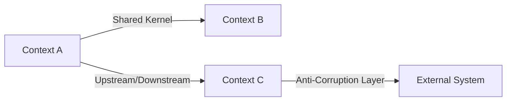

# Step 4: Domain-Driven Design

> Model the domain to ensure code structure reflects business concepts.

## When

L/XL tiers only. Can run **in parallel** with Step 5 (Architecture) if Step 3 is complete.

## Model

opus (complex domain reasoning)

## Input

- `{REQUIREMENTS}` from Step 1
- `{RESEARCH_FINDINGS}` from Step 2
- `{ADR_DECISIONS}` from Step 3
- Existing codebase domain structure

## Protocol

### 1. Identify Bounded Contexts

Analyze requirements for natural domain boundaries:

| Signal | Bounded Context |
|--------|----------------|
| Different stakeholders | Separate contexts |
| Different data lifecycles | Separate contexts |
| Different ubiquitous languages | Separate contexts |
| Shared data with different semantics | Separate contexts with shared kernel |

For **existing projects**: map new feature to existing bounded contexts first.
Only propose new contexts when the feature genuinely introduces a new domain.

### 2. Define Ubiquitous Language

For each bounded context involved:

```
## Context: {Name}

| Term | Definition | NOT to be confused with |
|------|-----------|------------------------|
| {Term1} | {Precise definition} | {Common misuse} |
| {Term2} | {Precise definition} | {Common misuse} |
```

Verify terms against:
- Existing codebase naming (Grep for conflicts)
- Requirement document terminology
- Stakeholder vocabulary

### 3. Model Aggregates & Entities

```
Aggregate: {Name}
├── Root Entity: {Name}
│   ├── {field}: {type}
│   └── {field}: {type}
├── Value Object: {Name}
│   └── {field}: {type}
└── Domain Event: {EventName}
    └── {payload}
```

Rules:
- Aggregates are consistency boundaries
- Entities have identity, Value Objects don't
- Domain Events signal state changes

### 4. Map Relationships



Relationship types:
- **Shared Kernel:** Shared code/models between contexts
- **Customer-Supplier:** Upstream provides, downstream consumes
- **Conformist:** Downstream adopts upstream model as-is
- **Anti-Corruption Layer:** Translate between incompatible models
- **Open Host Service:** Public API for multiple consumers

### 5. Validate Against Codebase

Check that proposed domain model is compatible with existing code:
- Do new entities conflict with existing names?
- Can aggregates be implemented with existing ORM/framework?
- Do relationships align with existing data access patterns?

## Output

Create `features/<slug>/04_domain_model.md` with:
- Bounded context map
- Ubiquitous language glossary
- Aggregate/Entity/VO definitions
- Relationship diagram (Mermaid)
- Mapping to existing codebase structures

Create `features/<slug>/diagrams/domain-model.mermaid`

Set `{DOMAIN_MODEL}` variable.

## Quality Gates

- [ ] All new terms defined in ubiquitous language
- [ ] No naming conflicts with existing codebase
- [ ] Aggregates have clear consistency boundaries
- [ ] Relationships between contexts are typed
- [ ] Domain model is implementable with current tech stack
