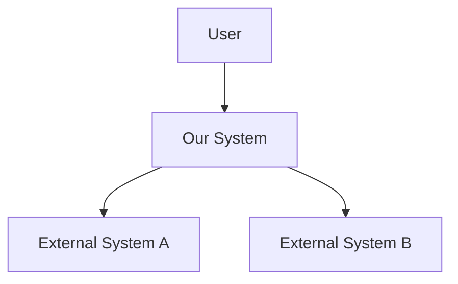
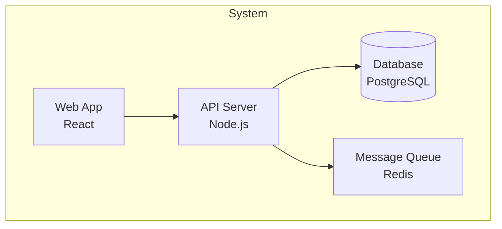
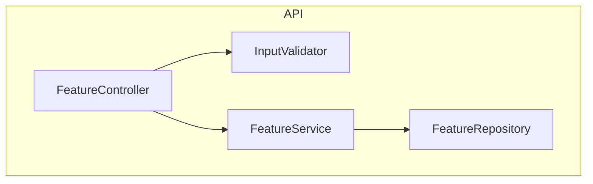
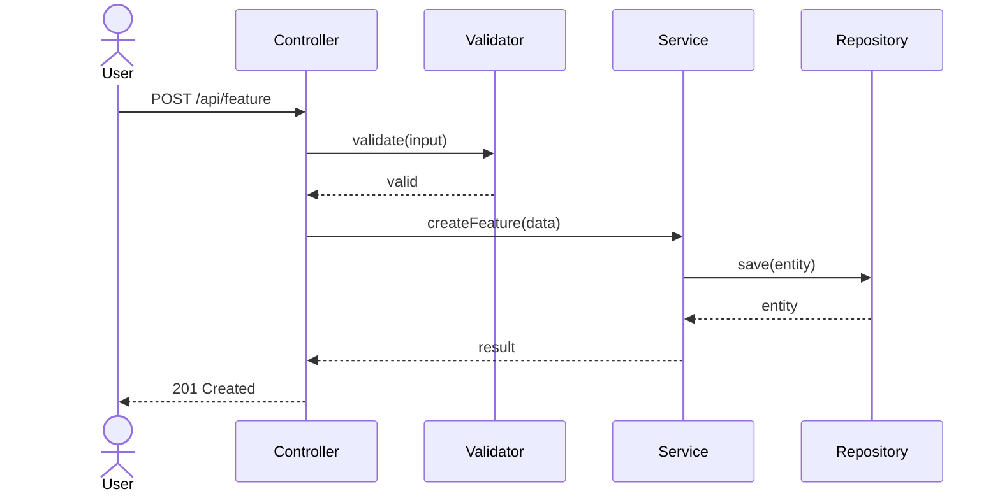

# Step 5: Technical Architecture

> Design the technical architecture using C4 diagrams and sequence flows.

## When

M+ tiers. Depth varies:
- **M:** Component diagram only (light)
- **L/XL:** Full C4 (Context + Container + Component) + sequence diagrams

## Model

opus (system design)

## Input

- `{REQUIREMENTS}` from Step 1
- `{ADR_DECISIONS}` from Step 3
- `{DOMAIN_MODEL}` from Step 4 (L/XL only)
- `{RESEARCH_FINDINGS}` from Step 2 (L/XL only)

## Protocol

### 1. C4 Level 1 — System Context (L/XL only)

Show the system in its environment:



Define:
- Who uses the system? (actors)
- What external systems does it interact with?
- What are the trust boundaries?

### 2. C4 Level 2 — Container Diagram (L/XL only)

Show high-level technical building blocks:



### 3. C4 Level 3 — Component Diagram (M/L/XL)

Show components within the container affected by this feature:



For M-tier: this is the ONLY diagram required.

### 4. Sequence Diagrams (L/XL)

For each main user flow, create a sequence diagram:



Create at minimum:
- Happy path flow
- Main error flow
- Async flow (if applicable)

### 5. Data Flow & Storage (L/XL)

Document:
- New tables/collections/schemas
- Migrations needed
- Data flow between components
- Caching strategy (if applicable)

### 6. API Design (if applicable)

For features exposing APIs:

```
POST /api/v1/{resource}
  Request: { field1: type, field2: type }
  Response: { id: string, ...fields }
  Errors: 400, 401, 404, 422

GET /api/v1/{resource}/:id
  Response: { ...full resource }
  Errors: 401, 404
```

## Output

### M-tier
Create `features/<slug>/05_architecture.md` with:
- Component diagram
- Brief API design (if applicable)

### L/XL-tier
Create `features/<slug>/05_architecture.md` with:
- C4 diagrams (all 3 levels)
- Sequence diagrams
- Data model changes
- API design

Create `features/<slug>/diagrams/`:
- `architecture-c4.mermaid`
- `sequence-*.mermaid`

Set `{ARCHITECTURE}` variable.

## Quality Gates

- [ ] Component diagram covers all new components
- [ ] Each component has clear responsibility
- [ ] ADR decisions are reflected in architecture
- [ ] Domain model (Step 4) maps to components (L/XL)
- [ ] Mermaid syntax is valid
- [ ] No circular dependencies between components
- [ ] API follows existing project conventions
