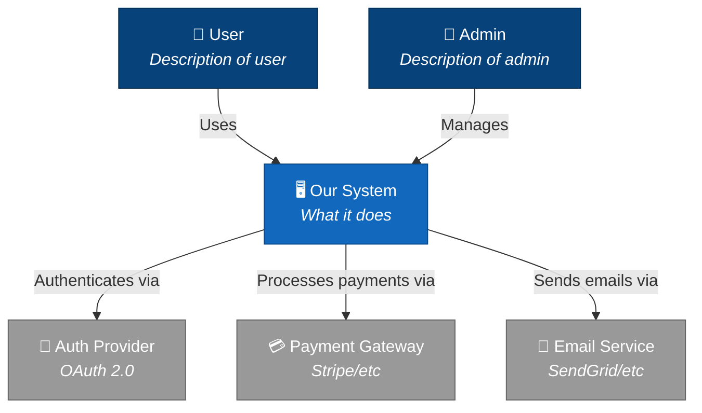
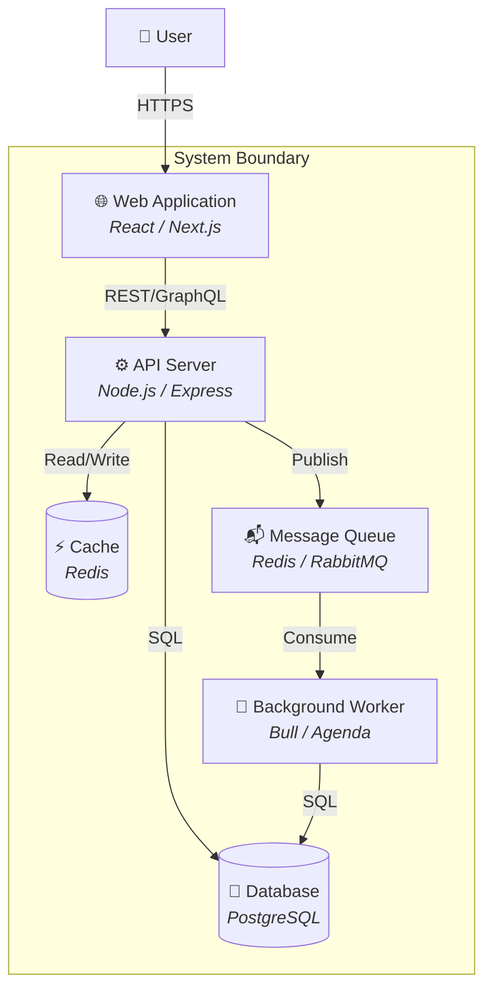
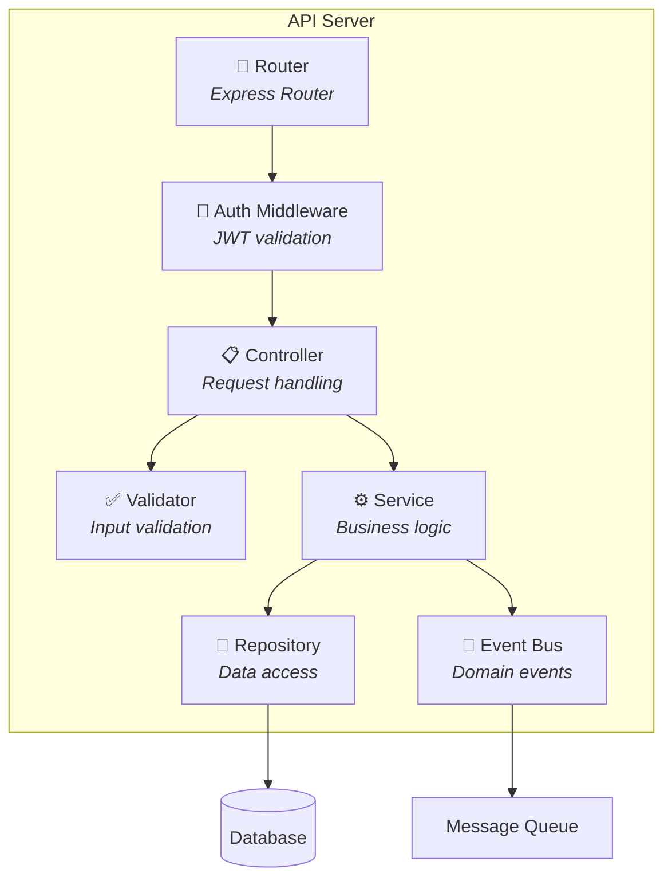
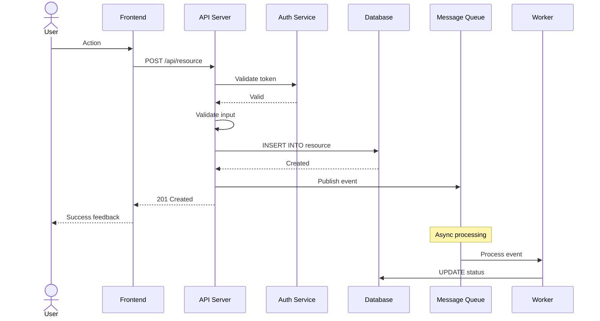

# C4 Diagram Templates

Reference templates for C4 architecture diagrams in Mermaid format.

---

## Level 1: System Context

## Level 2: Container

## Level 3: Component

## Sequence Diagram Template

## Tips

1. **Keep diagrams focused** — one concept per diagram
2. **Use consistent naming** — match code namespaces
3. **Show data flow direction** — arrows point from caller to callee
4. **Label relationships** — what protocol/format
5. **Highlight the new** — mark new components vs existing
